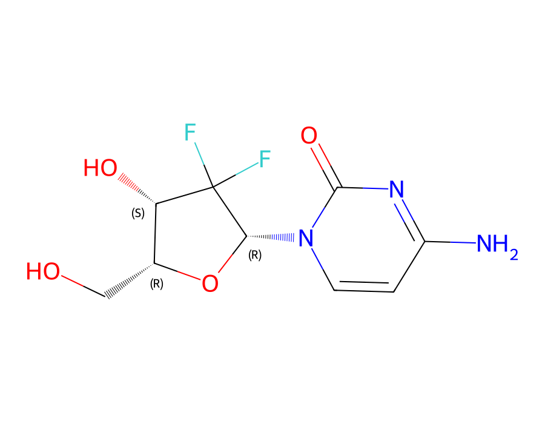

# Gemcitabine flexibility-term parameterization via SAVESTEPS

A worked, step-by-step example of fitting classical molecular-mechanics
bonded ("flexibility") force-field parameters — bond stretches, angle
bends, bond-bond/bond-angle/angle-angle cross terms, and torsions — for
**gemcitabine** (an oncology nucleoside-analog drug) against QM reference
data, using the **SAVESTEPS** topology-typing methodology (Manz group, NMSU:
<https://bitbucket.org/manzgroup/SAVESTEPS>).

This repo includes the actual CSV training/validation data and every script
used, so the method can be followed and rerun exactly, without needing to
regenerate multi-gigabyte QM output first. It's an extract of one part of a
larger pipeline; see [What this repo doesn't include](#what-this-repo-doesnt-include)
below.

  
   
  <em>Gemcitabine (2′,2′-difluoro-2′-deoxycytidine), C9H11F2N3O4 — rendered with RDKit.</em>

## Results

**Fixing the atom-ordering bug** (step 2 below) — same molecule, same
fitting methodology, only the atom correspondence changed:

| | Before fix | After fix |
|---|---|---|
| Training R² | 0.797 | **0.965** |
| Validation R² | 0.798 | **0.966** |

**Final fitted force-field variants** (step 3 below) — all three are
PSD-guaranteed stable by construction (confirmed with a 2000-step/0.1 fs
LAMMPS NVE run per variant, no thermostat):

| | Full cross (`fit_cross_psd.py`) | No angle-angle (`fit_cross_psd_no_angle_angle.py`) | GROMACS-native (`fit_cross_psd_gromacs_compatible.py`) |
|---|---|---|---|
| Bond stretches retained | 27/27 | 27/27 | 27/27 |
| Bends retained | 52/52 | 52/52 | 52/52 |
| Bond-bond cross retained | 48/52 | 42/52 | 10/52 |
| Bond-angle cross retained | 50/52 | 43/52 | 29/52 |
| Angle-angle cross retained | 58/78 | excluded from fit | excluded from fit |
| Torsion R² | — | — | 0.993 |
| Training R² | **0.963** | 0.950 | 0.942 |
| Validation R² | **0.964** | 0.951 | 0.943 |
| Min. Hessian eigenvalue (PSD margin) | 0.00101 | 0.00124 | 0.00100 |
| LAMMPS NVE TotEng range (200 fs) | **0.004 kcal/mol** | 0.004 kcal/mol | 0.0042 kcal/mol |

Use the full-cross variant unless your target MD engine has no
angle-angle-cross-term slot (GROMACS) — then use the no-angle-angle or
GROMACS-native variant, trading ~1–2 R² points for portability. See step 3
for what each variant actually changes.

## What "flexibility parameterization" means here

Given a QM-optimized equilibrium geometry and a set of QM reference
forces/energies sampled around it (Hessian finite-displacements + AIMD
trajectories, in this case — see step 2), fit harmonic/cross-term force
constants for every bonded interaction (bond, angle, bond-bond cross,
bond-angle cross, angle-angle cross, torsion) such that the resulting
classical force field reproduces the QM forces as closely as possible,
**while guaranteeing the fitted Hessian is positive-semidefinite** — i.e.
guaranteed stable for direct classical MD, not just a good regression fit.
That guarantee (not just "does the R² look OK") is the actual hard part of
this method, and is what most of step 3 below is about.

## Step-by-step

### 1. `01_savesteps_topology/` — topology typing

SAVESTEPS perceives bonds/angles/dihedrals from a molecular geometry and
groups them into symmetry-equivalent "types" (e.g. all six aromatic C–H
bonds in a benzene ring are one type, fit with one shared force constant).
It needs a VASP-style POSCAR as input, not the ORCA-optimized Cartesian xyz
you'll actually have — `glue_scripts/savesteps_run_builder.py` does that
conversion (also writes an atom-index map back to the original ordering,
since POSCAR requires atoms grouped by element).

**You'll need the SAVESTEPS base toolkit itself** — not included here
(third-party code, get it from the source above) — run its typing scripts
in sequence on the POSCAR from `savesteps_run_builder.py`. The output you
need for the next steps is a set of typed instance-list files:
`GEMCIT_bond_and_UB_instances_list.txt`, `GEMCIT_angle_instances_list.txt`,
`GEMCIT_dihedral_instances_list.txt` (+ each one's `..._types_list.txt`
companion) — real, worked examples of all of these for gemcitabine are in
`example_gemcitabine/02_savesteps_typed_output/`, so you can check your own
run's output format against a known-good reference.

**These files define this molecule's own atom ordering** — SAVESTEPS
groups atoms by element (all N, then all C, then all O, then F, then H for
gemcitabine) — which is *not* the same ordering your QM output will use.
This matters a lot; see step 2.

`glue_scripts/assemble_step7_inputs.py` then assembles the typed topology
plus the parsed QM data (next step) into the directory layout the fitting
scripts (step 3) expect.

### 2. `02_qm_data_parsing/` — QM reference data, and the one bug you must not repeat

The `parsed_output/` CSVs (`geom_forces_array_GEMCIT_*.csv`) are the actual
training/validation data used for the fit: per-sample atomic
positions + QM forces, for every Hessian finite-displacement point plus
every AIMD trajectory step, already parsed into one flat array per file.

**The single most consequential bug in this whole method**: the QM
package's own output ordering (ORCA `.engrad` files, in this case — a
different, connectivity-derived, interleaved order) is *not* the same as
SAVESTEPS' own element-grouped atom ordering from step 1. If you index QM
geometry/force arrays using SAVESTEPS' topology instance lists without
remapping first, you silently pair the wrong atoms together — this
produced a plausible-looking R² (comparable to what you'd expect from a
genuinely working fit — see [Results](#results) above) for a long stretch
of this project before being caught, and only surfaced because the
resulting force field overheated dramatically in actual MD despite being
mathematically guaranteed stable. Fixed via an explicit atom-by-atom
permutation, determined by nearest-neighbor coordinate matching
(`determine_orca_to_gemcit_permutation.py`) — confirmed every atom matches
at exactly 0.0000 Å.

**If you adapt this to a different QM package or a different molecule:
verify your geometry source's atom ordering against your topology tool's
atom ordering explicitly** (nearest-neighbor coordinate matching after
centroid-centering — `confirm_ordering_bug.py` shows the exact check: do
bond lengths, read out using the topology's atom indices against this
geometry, land in a physically sane 0.8–1.8 Å range?). Never assume two
files describing "the same molecule" share atom ordering just because
they're both correct descriptions of it.

`parse_orca_geom_forces.py` (Hessian + AIMD) and `parse_orca_spdft.py` +
`combine_spdft_csvs.py` (rotatable-dihedral single points) are the parsers
that produced the included CSVs — both already have the atom-ordering fix
applied. `confirm_ordering_bug.py` and `determine_orca_to_gemcit_permutation.py`
are the diagnostic/fix-derivation scripts themselves, included so the
methodology is fully auditable, not just the fixed result.

### 3. `03_flexibility_fitting/` — the actual fit

Run in this order if you want the full history; `fit_cross_psd.py` is the
one that actually produced the final numbers below.

1. **`fit.py`** — baseline: bonds, bends, torsions, independently (no
   cross-term coupling). Uses `glmnet_python` for weighted-LASSO automatic
   term selection. The safe, simple starting point.
2. **`fit_cross.py`** — adds bond-bond, bond-angle, and angle-angle cross
   terms. These are *indefinite* (saddle-shaped) quadratics — a joint LASSO
   fit can zero out a bond's own diagonal stiffness while keeping a cross
   term that touches it, leaving that coordinate literally unconfined for
   classical MD. This is the central problem the next script solves.
3. **`fit_cross_psd.py` + `cvxpy_constrained_solver.py`** — same weighted
   L1-penalized objective, but with a **positive-semidefinite constraint on
   the full bonded Hessian built into the convex program itself**
   (`cvxpy`, `CLARABEL`/`SCS` solvers — `glmnet` can't express this, it only
   supports independent per-coefficient box constraints, not a joint
   constraint spanning many coefficients at once). Reformulated as
   "sufficient statistics" (`0.5 b'Ab - c'b`, `A=XᵀWX`, `c=XᵀWy`) so a
   ~100,000-row design matrix collapses to a compact quadratic form the
   solver only ever sees — a ~50-point lambda path solves in seconds.

   **The constraint has to span the whole molecule at once, not per-atom or
   per-angle blocks** — every bond belongs to two atoms and every angle
   shares atoms with its neighbors, so any smaller decomposition misses
   cross-coupling through the shared coordinates. For gemcitabine this is
   one 82×82 global block (30 bonds + 52 angles). Verified this is
   necessary via two real LAMMPS crashes with smaller-block attempts before
   landing here — start at the global block for any new molecule, don't
   re-derive this the slow way. See [Results](#results) above for the
   fitted term counts and stability numbers this produces.

4. **`fit_cross_psd_no_angle_angle.py`** — same method, angle-angle cross
   terms excluded from the fit itself (not just dropped after fitting) —
   useful if your target MD engine has no angle-angle cross-term slot
   (GROMACS, for instance).
5. **`fit_cross_psd_gromacs_compatible.py`** — redefines the bond-angle
   cross term to GROMACS's own r13-coupled functional form (`U =
   k(r13-r13eq)[(r1-r1eq)+(r2-r2eq)]`, coupled to the direct distance
   between the angle's two outer atoms) rather than the θ-coupled form used
   above — these are genuinely different functional forms, not a unit
   conversion apart, so this variant *refits* rather than translates. Use
   this one if you're porting to GROMACS.
6. **`update_typing_files.py`**, **`reparse_old_hess_new_nve.py`** — utility
   scripts (regenerating typing-file variants, combining an older Hessian
   dataset with newer AIMD data without rerunning the whole Hessian batch).

`force_field_output/` holds all three fitted-parameter variants
(`GEMCIT_optimized_force_constants*.txt`) as the concrete end product of
this method.

## What this repo doesn't include

- **The SAVESTEPS base toolkit itself** — third-party code (Manz group,
  NMSU); get it from <https://bitbucket.org/manzgroup/SAVESTEPS> and check
  its own license/citation requirements.
- **Raw QM output** (ORCA Hessian/AIMD job directories, several GB) — only
  the parsed CSVs that came out of it. If you need to regenerate these from
  scratch (different molecule, different QM package), the parsing scripts
  here show exactly what format is expected.
- **Everything downstream of the fit** (translating these force constants
  into a runnable LAMMPS/GROMACS force field, non-bonded parameters,
  Drude-polarizable extensions, protein/binding-site work) — this repo is
  scoped specifically to the flexibility-fitting method. It's extracted
  from a fuller pipeline repo (currently private) that covers all of the
  above.

## License

MIT (see `LICENSE`) for the scripts in this repo. SAVESTEPS itself is
separately licensed by the Manz group — see their repository.
